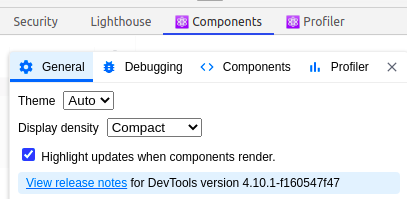
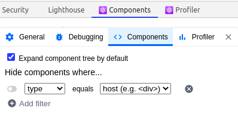
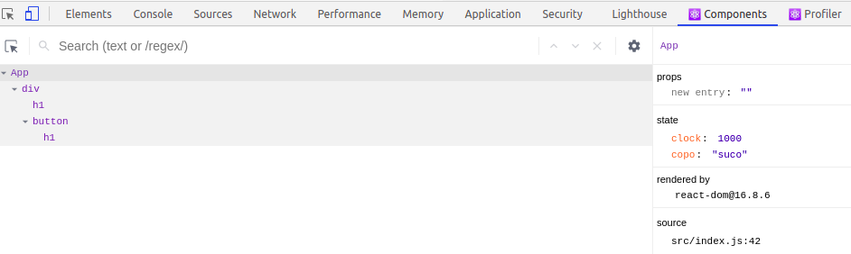
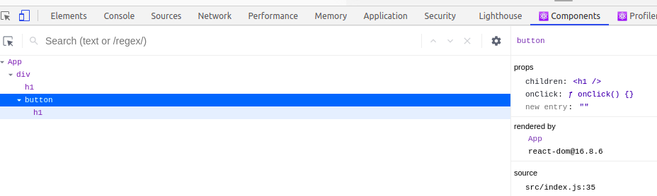
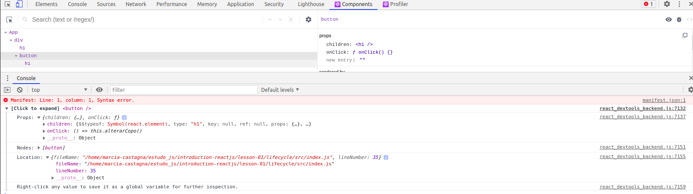

# Introdução ao ReactJS

- lesson-01

  - Renderização (pasta renderization)

  - Componentes (pasta components)

  - Ciclo de Vida (pasta lifecycle)

  - Configurar um projeto do zero

    - [Passos descritos abaixo em "Criar projeto do zero"](#Criar-projeto-do-zero)

      - exemplo (by me) pasta 'my-first-project'

      - outro exemplo projeto inicial na pasta 'configuration'. Rodar direto os comandos:
        ```shell
          npm install
          npm start
        ```

  - Exemplo JSX (pasta jsx)

- lesson-02

  - webpack-config (Como configurar **Webpack** + **ESLint**)

- lesson-03
  - Renderização condicional (pasta conditional-renderization)
  - Listas e chaves (pasta list-and-keys)
  - Manipulando eventos (pasta events-manipulation)
  - Dicas para pensar do jeito ReactJS (pasta thinking-react)

## Executar exemplos

1. Acessar a pasta com o assunto a visualizar

```shell
   $ cd lesson-01/renderization/
```

2. Executar os comandos

```shell
  $  npm install

  $  npm start
  OU
  $  npm run start
```

## React Developer Tools

"**_The Components tab shows you the root React components that were rendered on the page, as well as the subcomponents that they ended up rendering_**.

**_By selecting one of the components in the tree, you can inspect and edit its current props and state in the panel on the right. In the breadcrumbs you can inspect the selected component, the component that created it, the component that created that one, and so on._**"

- [Extensão do Chrome](https://chrome.google.com/webstore/detail/react-developer-tools/fmkadmapgofadopljbjfkapdkoienihi)
  - Exibe atualização na tela (tela "pisca" quando ocorre atualização)
    - Highlight updates when components render
  - Exibe hierarquia, props, children
  - Exibe o state











### Estado e ciclo de vida do ReactJS

Artigo sobre [Métodos do ciclo de vida de componentes ReactJS — Um mergulho profundo!](https://medium.com/creditas-tech/m%C3%A9todos-do-ciclo-de-vida-de-componentes-reactjs-um-mergulho-profundo-332ed7b3b782)

- Inicialização
  - props e state
- Montagem
  - componentWillMount (versão 17 removido)
  - render
  - componentDidMount
- Atualização
  - props
    - componetWillReceiveProps
    - shouldComponentUpdate
    - componentWillUpdate
    - render
    - componentDidUpdate
  - state
    - shouldComponentUpdate
    - componentWillUpdate
    - render
    - componentDidUpdate
- Desmontagem
  - componentWillUnmount

-> Cuidar com **gargalo de performance**: atualização de cada "pedaço", renderização demasiada (muito "re-render"), por não saber usar corretamente **shouldComponentUpdate**, **componentWillUpdate** e **componentDidUpdate**.

## Configuração

- React Create App

- React Scripts

- Task Runners e Bundler Sizers

## Criar projeto do zero

```shell

  $ mkdir my-first-project

  $ cd my-first-project

  $ npm init

  vários enters...

  $ yes

  $ npm install --save react@16.8.6 react-dom@16.8.6 react-scripts@3.0.1

      -> react-scripts : monta um servidor, não precisa configurar

  Alterar no arquivo "package.json":
    - incluir respectivos scripts em "scripts"
    - "main": "src/index.js"
    - inclur "devDependencies" com "typescript"

  Na raiz, criar pasta "public"

  Dentro da pasta "public", criar um arquivo "index.html" "basicão"
    - Dentro do "body" deve conter "div" com id="root"

    <!DOCTYPE html>
    <html lang="en">

    <head>
      <title>React App</title>
    </head>

    <body>
      <div id="root"></div>
    </body>

    </html>

Na raiz, criar pasta "src"

Dentro da pasta "src", criar dois arquivos: "index.js" e "styles.css"

  // **** index.js ****
  import React from "react";
  import ReactDOM from "react-dom";
  import "./styles.css";

  const App = () => {
    return <div className="App">Hello World</div>;
  };

  const rootElement = document.getElementById("root");
  ReactDOM.render(<App />, rootElement);

  // **** styles.css ****
  * {
    margin: 0;
    padding: 0;
  }

  body {
    font-size: 22px;
  }

  $ npm start


```

## JSX

- Não é obrigatório utilizar JSX
- Sintax Suggar para React.createElement
- Browser nao interpreta JSX... necessário transpilador (exemplo, o Babel)

## Webpack

- Modulo bundler: empacotador de módulos para aplicações js
- [Site oficial webpack](webpack.js.org)
- Entry
- Output
- Loaders
- Plugins
- Mode

  - Production
  - Development
  - None

- Projeto exemplo em 'lesson-02\webpack-config'

  **source-map** ajuda no debug (ao visualizar na ferramenta do desenvolvedor no navegador)

  // lesson-03 \ conditional-renderization
  Executar 'npm run build' para webpack em modo produção
  Executar 'npm run dev' para webpack em modo desenvolvimento
  Executar 'npm run start' para subir servidor em modo desenvolvimento
  Executar 'npm run eslint' para executar o eslint

  ```
    "build": "webpack --mode production",
    "dev": "webpack --mode development",
    "start": "webpack-dev-server --open --hot --mode development",
    "eslint": "eslint ./src/*.js"
  ```

  Dependência para gerar servidor: webpack-dev-server
  -> localhost:8080

## ESLint

```shell
   $  npm run eslint
```

- qualidade
- manter padrão de desenvolvimento

## Resumo Webpack, ESLint

Loaders - É uma configuração que permite que o webpack gerencie arquivos que não são JavaScript.

Babel - É um compilador e transpilador de JS.

Tipos de suporte do webpack: Fontes, CSS, Imagens, HTML, JS e Plugins.

Entry na configuração do webpack: É o ponto de entrada para o webpack buscar todos os módulos e dependências.

O que é webpack? É um module bundlers (um empacotador de módulos para aplicações JS).

Funcionalidade do Eslint: Validação de código.

Principais conceitos do webpack: Entry, Output, Loaders, Plugins e Mode.

Output na configuração do webpack: É para determinar quais são os bundlers que o webpack irá emitir.

Através de qual dependência é possível criar um servidor de desenvolvimento local? webpack-dev-server.

Tipos de modes existentes por padrão no webpack: Production, Development e None.


## Referência

https://github.com/Tautorn/introduction-reactjs

https://github.com/marciafc/introduction-reactjs
